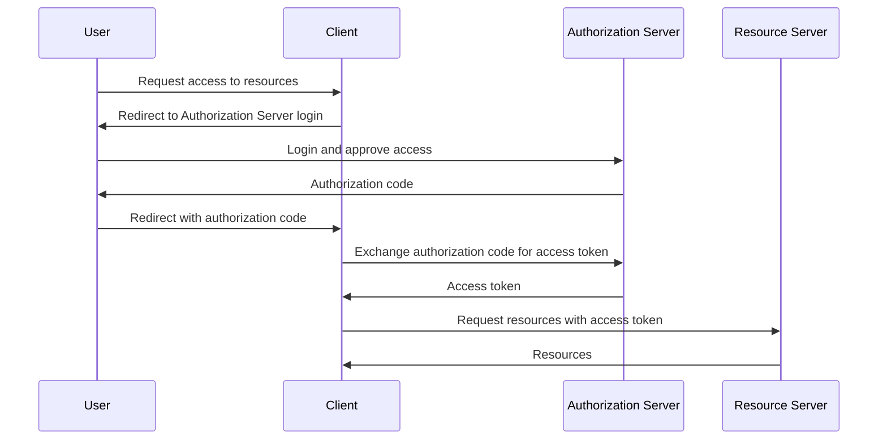
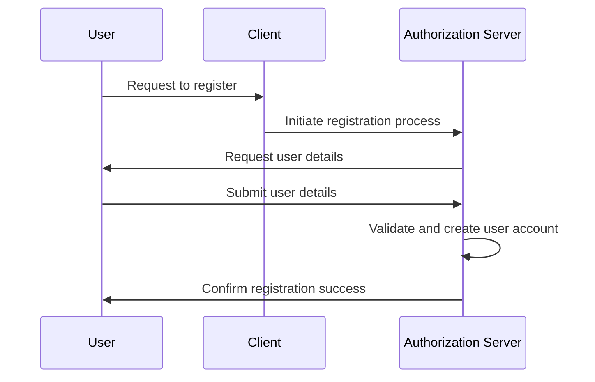
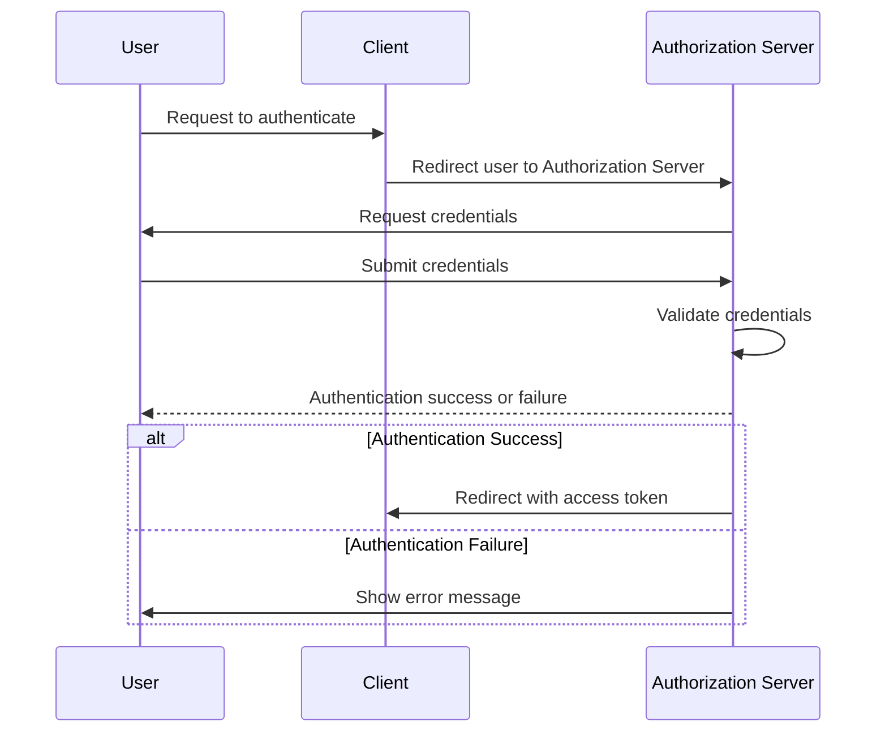
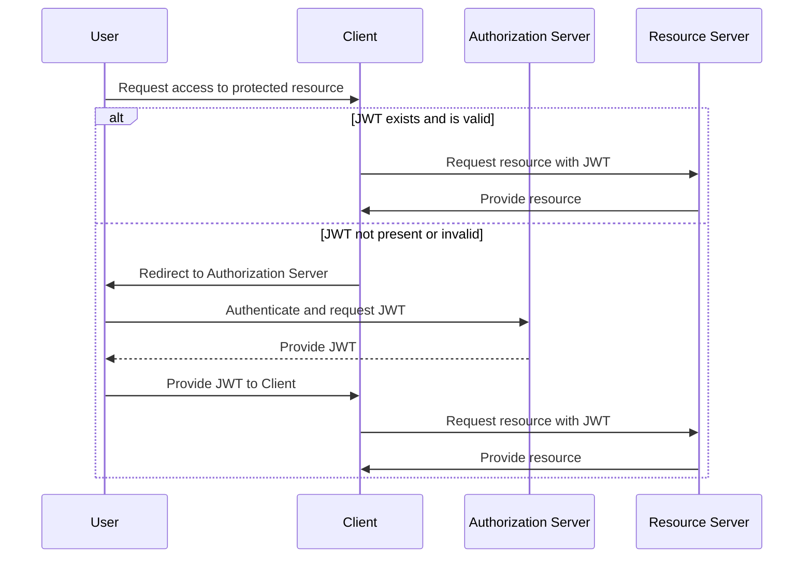

# AuthNexus

A monorepo to house a generic solution for OAuth 2 authentication and authorization.

## Overview

### OAuth 2.0

### Registration

### Authentication

### Authroization with JWT

## Usage

When updating a shared dependency, you can do so in it's own project directory and then run `go mod tidy` in each 
dependent project to ensure they are using the updated version.

## References

- [OAuth 2.0](https://oauth.net/2/)
- [JWT](https://jwt.io/)
- [OpenID Connect](https://openid.net/connect/)
- [The Twelve-Factor App](https://12factor.net/)
- [Configuration with Viper in Go](https://medium.com/@amitshekhar/configuration-with-viper-in-go-e49db1b4ff37)
- [Viper Configuration Package on GitHub](https://github.com/spf13/viper)
- [Go Backend Clean Architecture](https://github.com/amitshekhariitbhu/go-backend-clean-architecture)
- [Test Containers for Go](https://golang.testcontainers.org/)
- [Project Documentation](docs/index.md)
- [How to use Godog for BDD development in Go](https://semaphoreci.com/community/tutorials/how-to-use-godog-for-behavior-driven-development-in-go)
- [Example Go Monorepo](https://github.com/Medium-Stories/go-mono-repo)
- [Go Project Structure Monorepo](https://blog.devops.dev/go-project-structure-monorepo-daa762ec36a2)
- [How to create and use a Go monorepo](https://scriptable.com/golang/how-to-create-and-use-a-go-monorepo/)
- [Getting started with multi-module workspaces in Go](https://go.dev/doc/tutorial/workspaces/)
- [Get familiar with workspaces](https://go.dev/blog/get-familiar-with-workspaces)
- [How I write HTTP services in Go](https://grafana.com/blog/2024/02/09/how-i-write-http-services-in-go-after-13-years/)
- [Local Development of Go Applications with Testcontainers](https://www.docker.com/blog/local-development-of-go-applications-with-testcontainers/)
- [Logging HTTP Requests in Go](https://blog.kowalczyk.info/article/e00e89c3841e4f8c8c769a78b8a90b47/logging-http-requests-in-go.html)
- [Swagger UI](https://github.com/swagger-api/swagger-ui/releases/)