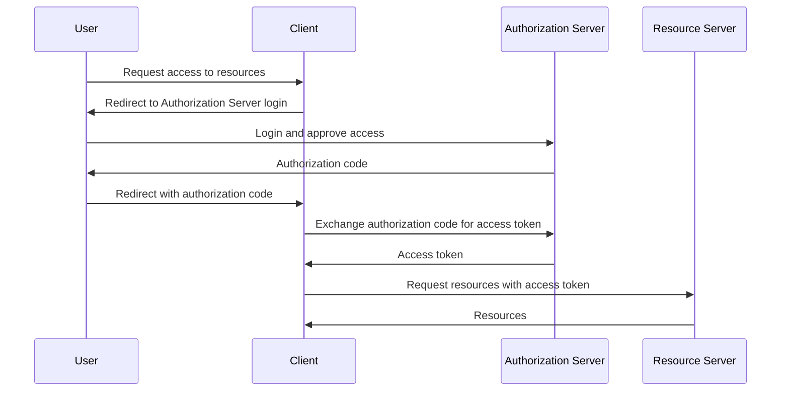
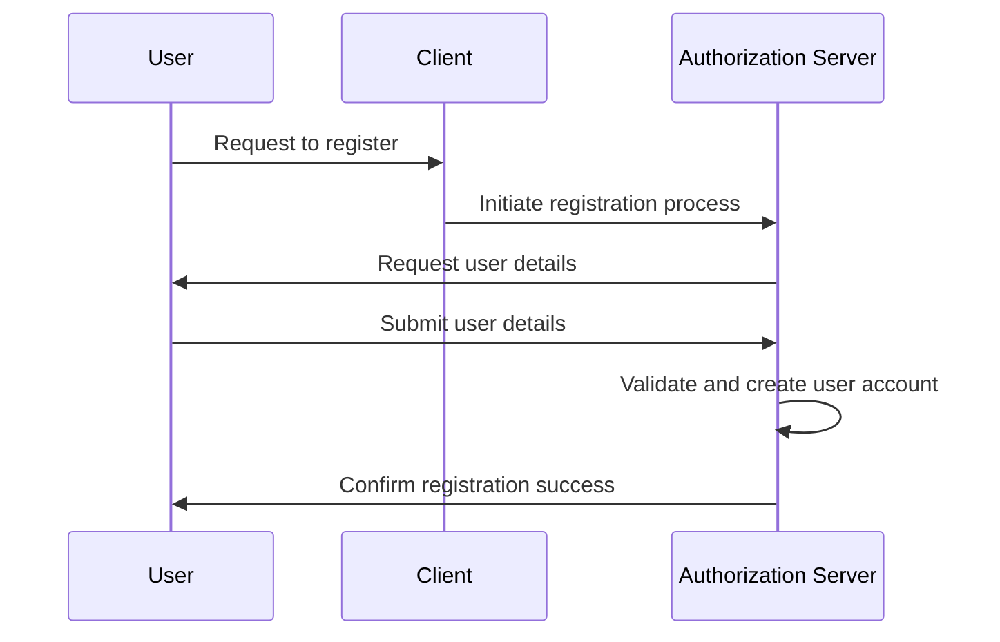
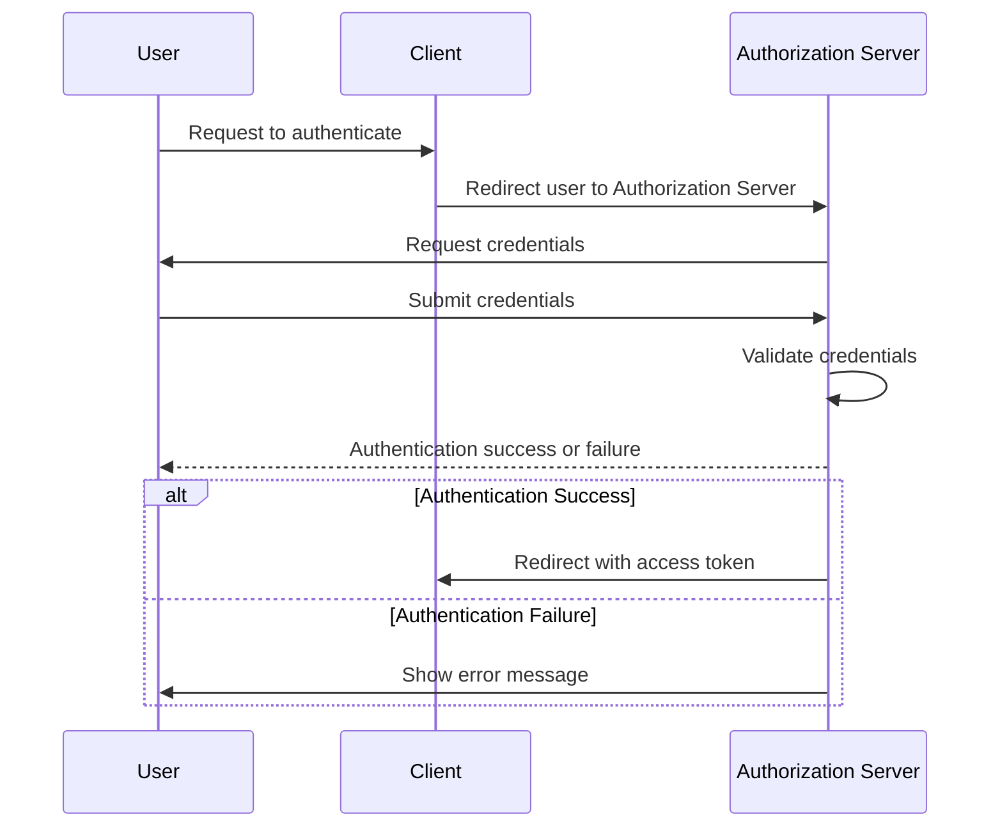
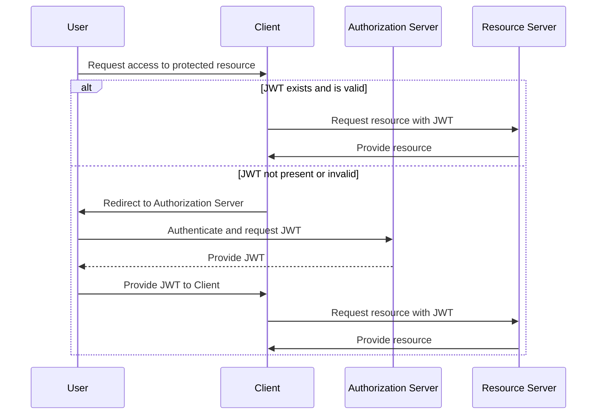

# AuthNexus

A monorepo to house a generic solution for OAuth 2 authentication and authorization.

## Overview

### OAuth 2.0

### Registration

### Authentication

### Authroization with JWT

## Usage

When updating a shared dependency, you can do so in it's own project directory and then run `go mod tidy` in each 
dependent project to ensure they are using the updated version.

